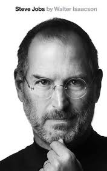

#What is Google Cloud Platform ?

~~sub-section~~

- Compute
- Compute Engine
- Storage
- Cloud Storage
- Cloud Datastore
- Cloud SQL
- Big Data
- Bigquery
- Services
- Cloud Endpoints
- Translate API
- Prediction API
- Product as a Service
- Google App Engine

~~sub-section~~

## Scenerios we use Google Cloud Platform

~~sub-section~~

##Gaming

- Cloud Endpoints

- App Engine

- Compute Engine

- Cloud Storage

- Cloud Datastore

- Big Query

~~sub-section~~

##Mobile

- Cloud Endpoints

- App Engine

- Compute Engine

- Cloud Storage

- Cloud Datastore

~~sub-section~~

# Who Uses it?

~~sub-section~~

- Rovio

- Snapchat

- Khan Academy

- Pulse

~~sub-section~~

## Why Use it?

~~sub-section~~

- Automatic Scaling

- Run on Google's Infrastructure

- Mix and match of all the Google Cloud Services and APIs

- Performance you can count on

- Focus on building the product

- Get the support you need

~~sub-section~~

##What are the some of the misconceptions?

~~sub-section~~

- Google App Engine is a web framework

- Google App Engine is a VPS

- Google App Engine is a SaaS

~~sub-section~~

##Why this is Wrong!!!!!!

~~sub-section~~

- Google App Engine is an PaaS

- Compute Engine is Google's IaaS

- Cloud Endpoints is an example of a SaaS

~~sub-section~~

## So which Languages are supported??

~~sub-section~~

- Python

- Java

- Go

- PHP

~~sub-section~~

## Enough talk lets get down to business

~~sub-section~~

## Just Make it ......

~~sub-section~~

## Don't make it a secret

~~sub-section~~

~~sub-section~~

## Forget about the next Billion Dollar idea

~~sub-section~~

if this is your main idea, then this is simply not for you

~~sub-section~~

it will undermine your most pure motivations

~~sub-section~~

it is as likely as to win the lottery

~~sub-section~~

## Don't follow the BIG "LIE"!!!!!

~~sub-section~~

it is unusual to meet success the right way

~~sub-section~~

##Even the guys i am goig to tell you about failed in the first place

~~sub-section~~

~~sub-section~~

~~sub-section~~

 Permanent "Beta"

~~sub-section~~

 experience will make you better

~~sub-section~~

##Celebrate your Defeats

~~sub-section~~

'

~~sub-section~~

## Keep Dreaming and never give up

~~sub-section~~

# Community is Big

Learn share win!!

~~sub-section~~

## Programs

- GDG - Google Developer Group

- GBG - Google Business Group

- GDE - Google Developer Experts

- Google Developer Startup Launch

- Campus Program

- Udacity Work Groups

~~sub-section~~

## Udacity Work Group

~~sub-section~~

Will start in March 2015 and GDG Kiamthi University has enrolled

~~

Whoo!!!

~~

## Thanks

~~
